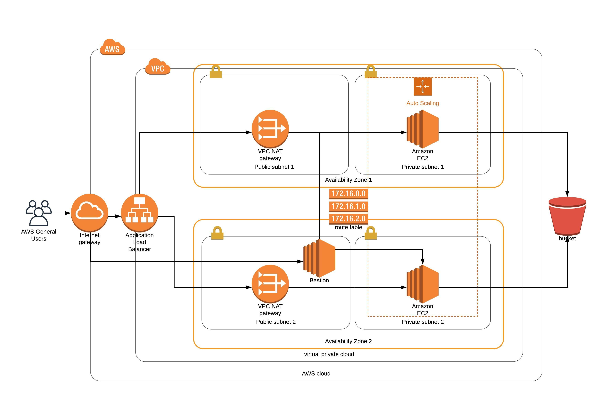

# nano-devops-02

Project 2 of the Udacity Nanodegree:

Using Cloud Formation: deploy an application (Apache Web Server) and pick up code (JavaScript and HTML) from S3 Storage and deploy it in the appropriate folder on the web server.

## Architecture diagram



## How to run

```bash
# enter your credentials for AWS account
aws configure

# set up network infrastructure
cd scripts; ./awsCoUp.sh network ../cf/network.yml ../cf/network-parameters.json; cd ..

# wait for the network stack to complete before running, set up servers
cd scripts; ./awsCoUp.sh servers ../cf/servers.yml ../cf/servers-parameters.json; cd ..

# copy ssh key to bastion server
scp -i ~/dev/awsKeys/jumpbox-key.pem ~/dev/awsKeys/private-server-devops-key.pem ubuntu@34.221.141.90:/home/ubuntu/private-server-devops-key.pem

# ssh to jump server
ssh ubuntu@34.221.141.90 -i ~/dev/awsKeys/jumpbox-key.pem

ssh ubuntu@10.0.3.91 -i ./private-server-devops-key.pem
```


